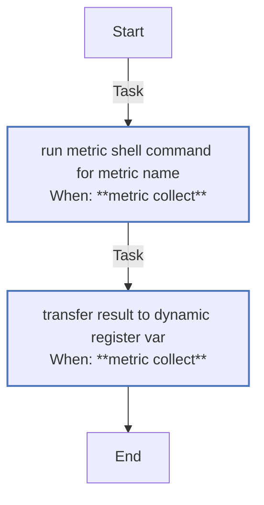
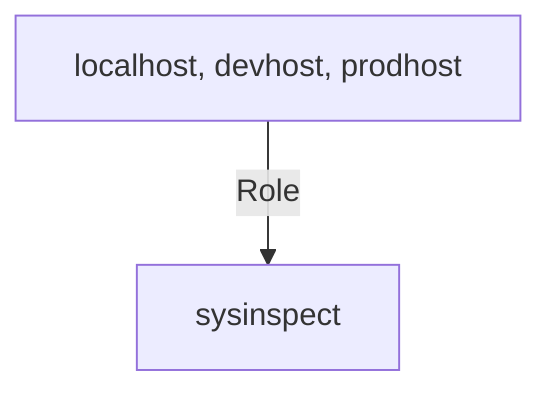

<!-- DOCSIBLE START -->

# 📃 Role overview

## sysinspect


Description: Ansible role for collecting system metrics (CPU, memory, disk, OS, and network). Designed for diagnostics, compliance reporting, monitoring integration, or automated system audits. Test url link [url to..](https://github.com/docsible/sysinspect/edit/main/meta/main.yml)


| Field                | Value           |
|--------------------- |-----------------|
| Readme update        | 08/05/2025 |


<details>
<summary><b>🧩 Argument Specifications in meta/argument_specs</b></summary>

#### Key: main

**Description**: 


**Options**:


  - **sysinspect_debug_mode**
    - **Required**: False
    - **Type**: bool
    - **Default**: True
  
    - **Description**: If true, enables debug output including the final JSON report printed to the terminal.

  
  
  

  - **sysinspect_report_output_path**
    - **Required**: False
    - **Type**: str
    - **Default**: /tmp/system_report.json
  
    - **Description**: Path where the final JSON report will be written on the target host.

  
  
  

  - **sysinspect_report_webhook_url**
    - **Required**: False
    - **Type**: str
    - **Default**: 
  
    - **Description**: Optional URL of a webhook endpoint to which the report will be POSTed.

  
  
  

  - **sysinspect_collect_hardware**
    - **Required**: False
    - **Type**: bool
    - **Default**: True
  
    - **Description**: Whether to collect CPU, memory, and disk metrics.

  
  
  

  - **sysinspect_collect_os**
    - **Required**: False
    - **Type**: bool
    - **Default**: True
  
    - **Description**: Whether to collect OS version, kernel, and system uptime.

  
  
  

  - **sysinspect_collect_network**
    - **Required**: False
    - **Type**: bool
    - **Default**: True
  
    - **Description**: Whether to collect IP address and basic network diagnostics.

  
  
  

  - **sysinspect_cpu_alert_threshold**
    - **Required**: False
    - **Type**: int
    - **Default**: 90
  
    - **Description**: CPU usage percentage above which a warning alert is triggered.

  
  
  

  - **sysinspect_memory_alert_threshold**
    - **Required**: False
    - **Type**: int
    - **Default**: 90
  
    - **Description**: Memory usage percentage above which a warning alert is triggered.

  
  
  

  - **myapp_int**
    - **Required**: False
    - **Type**: int
    - **Default**: 42
    - **Description**: 
   - The integer value, defaulting to 42.
   - This is a second paragraph.
  
  
  
  

  - **myapp_str**
    - **Required**: True
    - **Type**: str
    - **Default**: none
  
    - **Description**: The string value
  
  
  

  - **myapp_list**
    - **Required**: True
    - **Type**: list
    - **Default**: none
  
    - **Description**: A list of string values.
  
  
  

  - **myapp_list_with_dicts**
    - **Required**: False
    - **Type**: list
    - **Default**: [{'myapp_food_kind': 'meat', 'myapp_food_boiling_required': True, 'myapp_food_preparation_time': 60}, {'myapp_food_kind': 'fruits', 'myapp_food_preparation_time': 5}]
  
    - **Description**: A list of dicts with a defined structure and with default a value.
  
  
  
    
      
        

    - **myapp_food_kind**
      - **Required**: false
      - **Type**: 
      - **Default**: none
      - **Description**: 
  
  
  
  

    - **myapp_food_boiling_required**
      - **Required**: false
      - **Type**: 
      - **Default**: none
      - **Description**: 
  
  
  
  

    - **myapp_food_preparation_time**
      - **Required**: false
      - **Type**: 
      - **Default**: none
      - **Description**: 
  
  
  
  


      
    
      
        

    - **myapp_food_kind**
      - **Required**: false
      - **Type**: 
      - **Default**: none
      - **Description**: 
  
  
  
  

    - **myapp_food_preparation_time**
      - **Required**: false
      - **Type**: 
      - **Default**: none
      - **Description**: 
  
  
  
  


      
    
  

  - **myapp_dict_with_suboptions**
    - **Required**: False
    - **Type**: dict
    - **Default**: {'myapp_host': 'bar.foo', 'myapp_exclude_host': True, 'myapp_path': '/etc/myapp'}
  
    - **Description**: A dict with a defined structure and default values.
  
  
  
    

    - **myapp_host**
      - **Required**: True
      - **Type**: str
      - **Default**: none
  
      - **Description**: A string value with a limited list of allowed choices.
  
        - **Choices**:
    
            - foo.bar
    
            - bar.foo
    
            - ansible.foo.bar
    
  
  
  

    - **myapp_exclude_host**
      - **Required**: True
      - **Type**: bool
      - **Default**: none
  
      - **Description**: A boolean value.
  
  
  

    - **myapp_path**
      - **Required**: True
      - **Type**: path
      - **Default**: none
  
      - **Description**: A path value.
  
  
  

    - **original_name**
      - **Required**: False
      - **Type**: list
      - **Default**: none
  
      - **Description**: An optional list of string values.
  
  
  


  


#### Key: alternate

**Description**: 
- This is the alternate entrypoint for the C(myapp) role.


**Options**:


  - **myapp_int**
    - **Required**: False
    - **Type**: int
    - **Default**: 1024
  
    - **Description**: The integer value, defaulting to 1024.
  
  
  


</details>


### Defaults

**These are static variables with lower priority**

#### File: defaults/main.yml

| Var          | Type         | Value       |Required    | Title       |
|--------------|--------------|-------------|------------|-------------|
| [my-var1-key1-reference](defaults/main.yml#L8)   | dict | `{}` |    false  |  Test issue 100 key1 |
| [my-var1-key1-reference.**sub-key11**](defaults/main.yml#L9)   | str | `sub-key11-value` |    None  |  None |
| [my-var1-key1-reference.**sub-key12**](defaults/main.yml#L10)   | str | `sub-key12-value` |    None  |  None |
| [my-var1-key2-reference](defaults/main.yml#L15)   | dict | `{}` |    false  |  Test issue 100 key2 |
| [my-var1-key2-reference.**sub-key21**](defaults/main.yml#L16)   | str | `sub-key11-value` |    None  |  None |
| [my-var1-key2-reference.**sub-key22**](defaults/main.yml#L17)   | str | `sub-key12-value` |    None  |  None |
| [my-var1-key3-reference](defaults/main.yml#L20)   | dict | `{}` |    None  |  None |
| [my-var1-key3-reference.**sub-key31**](defaults/main.yml#L21)   | str | `sub-key31-value` |    None  |  None |
| [my-var1-key3-reference.**sub-key32**](defaults/main.yml#L22)   | str | `sub-key32-value` |    None  |  None |
| [my-var1](defaults/main.yml#L24)   | dict | `{}` |    None  |  None |
| [my-var1.**key1**](defaults/main.yml#L25)   | str | `<multiline value: folded_strip>` |    None  |  None |
| [my-var1.**key2**](defaults/main.yml#L27)   | str | `<multiline value: folded_strip>` |    None  |  None |
| [my-var1.**key3**](defaults/main.yml#L29)   | str | `<multiline value: folded_strip>` |    None  |  None |
| [sysinspect_debug_mode](defaults/main.yml#L37)   | bool | `True` |    false  |  Enable debug mode for detailed output |
| [sysinspect_common_resolv_conf_literal](defaults/main.yml#L42)   | str | `<multiline value: literal>` |    false  |  Test issue 83 |
| [sysinspect_common_resolv_conf_folded](defaults/main.yml#L50)   | str | `<multiline value: folded>` |    false  |  Test issue 83 |
| [sysinspect_common_resolv_conf_literal_indent](defaults/main.yml#L58)   | str | `<multiline value: literal_indent_2>` |    false  |  Test issue 83 |
| [sysinspect_common_resolv_conf_folded_indent](defaults/main.yml#L66)   | str | `<multiline value: folded_indent_2>` |    false  |  Test issue 83 |
| [sysinspect_common_resolv_conf_list](defaults/main.yml#L74)   | list | `[]` |    false  |  Test issue 83 |
| [sysinspect_common_resolv_conf_list.**0**](defaults/main.yml#L75)   | str | `search domain.local` |    None  |  None |
| [sysinspect_common_resolv_conf_list.**1**](defaults/main.yml#L76)   | str | `nameserver 8.8.8.8` |    None  |  None |
| [sysinspect_common_resolv_conf_list.**2**](defaults/main.yml#L77)   | str | `nameserver 8.8.4.4` |    None  |  None |
| [sysinspect_b](defaults/main.yml#L82)   | str | `<multiline value: literal_keep>` |    false  |  Literal with chomping "keep" |
| [sysinspect_c](defaults/main.yml#L90)   | str | `<multiline value: literal_strip>` |    false  |  Literal with chomping "strip" |
| [sysinspect_myval](defaults/main.yml#L97)   | str | `<multiline value: literal_indent_4>` |    false  |  Literal with indent=4 |
| [sysinspect_val1](defaults/main.yml#L104)   | str | `<multiline value: literal_keep_indent_2>` |    false  |  Literal with chomping "keep" and indent=2 |
| [sysinspect_val2](defaults/main.yml#L112)   | str | `<multiline value: literal_strip_indent_4>` |    false  |  Literal with chomping "strip" and indent=4 |
| [sysinspect_val3](defaults/main.yml#L120)   | str | `<multiline value: literal_keep_indent_2>` |    false  |  Literal with indent=2 and chomping "keep" |
| [sysinspect_report_output_path](defaults/main.yml#L130)   | str | `/tmp/system_report.json` |    true  |  Output path for system report |
| [sysinspect_report_webhook_url](defaults/main.yml#L136)   | str |  |    false  |  Send report to webhook |
| [sysinspect_collect_hardware](defaults/main.yml#L142)   | bool | `True` |    true  |  Collect CPU, memory, and disk usage |
| [sysinspect_collect_os](defaults/main.yml#L148)   | bool | `True` |    true  |  Collect OS, kernel, and uptime info |
| [sysinspect_collect_network](defaults/main.yml#L153)   | bool | `True` |    true  |  Collect network information (IP addresses) |
| [sysinspect_cpu_alert_threshold](defaults/main.yml#L158)   | int | `90` |    false  |  CPU usage alert threshold |
| [sysinspect_memory_alert_threshold](defaults/main.yml#L163)   | int | `90` |    false  |  Memory usage alert threshold |

#### File: defaults/main/another_default_test.yml

| Var          | Type         | Value       |Required    | Title       |
|--------------|--------------|-------------|------------|-------------|
| [sysinspect_debug_mode](defaults/main/another_default_test.yml#L10)   | bool | `True` |    false  |  Enable debug mode for detailed output |

#### File: defaults/main/main.yml

| Var          | Type         | Value       |Required    | Title       |
|--------------|--------------|-------------|------------|-------------|
| [sysinspect_debug_mode](defaults/main/main.yml#L10)   | bool | `True` |    false  |  Enable debug mode for detailed output |
| [my-var1-key1-reference](defaults/main/main.yml#L15)   | dict | `{}` |    false  |  Test issue 100 key1 |
| [my-var1-key1-reference.**sub-key11**](defaults/main/main.yml#L16)   | str | `sub-key11-value` |    None  |  None |
| [my-var1-key1-reference.**sub-key12**](defaults/main/main.yml#L17)   | str | `sub-key12-value` |    None  |  None |
| [my-var1-key2-reference](defaults/main/main.yml#L22)   | dict | `{}` |    false  |  Test issue 100 key2 |
| [my-var1-key2-reference.**sub-key21**](defaults/main/main.yml#L23)   | str | `sub-key11-value` |    None  |  None |
| [my-var1-key2-reference.**sub-key22**](defaults/main/main.yml#L24)   | str | `sub-key12-value` |    None  |  None |
| [my-var1-key3-reference](defaults/main/main.yml#L27)   | dict | `{}` |    None  |  None |
| [my-var1-key3-reference.**sub-key31**](defaults/main/main.yml#L28)   | str | `sub-key31-value` |    None  |  None |
| [my-var1-key3-reference.**sub-key32**](defaults/main/main.yml#L29)   | str | `sub-key32-value` |    None  |  None |
| [my-var1](defaults/main/main.yml#L31)   | dict | `{}` |    None  |  None |
| [my-var1.**key1**](defaults/main/main.yml#L32)   | str | `<multiline value: folded_strip>` |    None  |  None |
| [my-var1.**key2**](defaults/main/main.yml#L34)   | str | `<multiline value: folded_strip>` |    None  |  None |
| [my-var1.**key3**](defaults/main/main.yml#L36)   | str | `<multiline value: folded_strip>` |    None  |  None |
<details>
<summary><b>🖇️ Full descriptions for vars in defaults/main.yml</b></summary>
<br>
<table>
<th>Var</th><th>Description</th>
<tr><td><b>my-var1-key1-reference</b></td><td>test description key2.</td></tr>
<tr><td><b>my-var1-key2-reference</b></td><td>test description key2.</td></tr>
<tr><td><b>sysinspect_debug_mode</b></td><td>If true, the role will display additional debug information at runtime,<br>
including the final assembled JSON report before writing or sending it.<br></td></tr>
<tr><td><b>sysinspect_common_resolv_conf_literal</b></td><td>Literal style, preserves newlines and indentation exactly</td></tr>
<tr><td><b>sysinspect_common_resolv_conf_folded</b></td><td>Folded style, converts newlines to spaces</td></tr>
<tr><td><b>sysinspect_common_resolv_conf_literal_indent</b></td><td>Literal style with indent indicator, preserves newlines; forces 2-space indentation (⚠️ may not be supported in Ansible)</td></tr>
<tr><td><b>sysinspect_common_resolv_conf_folded_indent</b></td><td>Folded style with indent indicator, newlines become spaces; forces 2-space indentation (⚠️ may not be supported)</td></tr>
<tr><td><b>sysinspect_common_resolv_conf_list</b></td><td>List of lines, one item per DNS line (best for iteration in templates)</td></tr>
<tr><td><b>sysinspect_b</b></td><td>Literal style, preserves all trailing newlines</td></tr>
<tr><td><b>sysinspect_c</b></td><td>Literal style, strips all trailing newlines</td></tr>
<tr><td><b>sysinspect_myval</b></td><td>Literal style with forced 4-space indentation (⚠️ non-portable)</td></tr>
<tr><td><b>sysinspect_val1</b></td><td>Keeps newlines and enforces 2-space indent (⚠️ not safe in all parsers)</td></tr>
<tr><td><b>sysinspect_val2</b></td><td>Strips trailing newlines and forces 4-space indent (⚠️ avoid in Ansible)</td></tr>
<tr><td><b>sysinspect_val3</b></td><td>Same as above; order of indicators doesn't matter (⚠️ not always supported)</td></tr>
<tr><td><b>sysinspect_report_output_path</b></td><td>Path where the final JSON report will be written.</td></tr>
<tr><td><b>sysinspect_report_webhook_url</b></td><td>URL of the HTTP endpoint that will receive the report.</td></tr>
<tr><td><b>sysinspect_collect_hardware</b></td><td>Enable or disable hardware metric collection.</td></tr>
<tr><td><b>sysinspect_collect_os</b></td><td>Enable or disable operating system info collection.</td></tr>
<tr><td><b>sysinspect_collect_network</b></td><td>Enable or disable network diagnostics.</td></tr>
<tr><td><b>sysinspect_cpu_alert_threshold</b></td><td>If CPU usage exceeds this percentage, it will trigger an alert.</td></tr>
<tr><td><b>sysinspect_memory_alert_threshold</b></td><td>If memory usage exceeds this percentage, it will trigger an alert.</td></tr>
</table>
<br>
</details>
<details>
<summary><b>🖇️ Full descriptions for vars in defaults/main/another_default_test.yml</b></summary>
<br>
<table>
<th>Var</th><th>Description</th>
<tr><td><b>sysinspect_debug_mode</b></td><td>If true, the role will display additional debug information at runtime,<br>
including the final assembled JSON report before writing or sending it.<br></td></tr>
</table>
<br>
</details>
<details>
<summary><b>🖇️ Full descriptions for vars in defaults/main/main.yml</b></summary>
<br>
<table>
<th>Var</th><th>Description</th>
<tr><td><b>sysinspect_debug_mode</b></td><td>If true, the role will display additional debug information at runtime,<br>
including the final assembled JSON report before writing or sending it.<br></td></tr>
<tr><td><b>my-var1-key1-reference</b></td><td>test description key2.</td></tr>
<tr><td><b>my-var1-key2-reference</b></td><td>test description key2.</td></tr>
</table>
<br>
</details>


### Vars

**These are variables with higher priority**
#### File: vars/main.yml

| Var          | Type         | Value       |Required    | Title       |
|--------------|--------------|-------------|------------|-------------|
| [sysinspect_suite_name](vars/main.yml#L8)   | str | `System Inspector v2.0` |    true  |  Name of the diagnostic suite |
| [sysinspect_phases](vars/main.yml#L15)   | list | `[]` |    true  |  Phases of system inspection |
| [sysinspect_phases.**0**](vars/main.yml#L16)   | dict | `{}` |    None  |  None |
| [sysinspect_phases.0.**id**](vars/main.yml#L16)   | str | `hardware_check` |    None  |  None |
| [sysinspect_phases.0.**label**](vars/main.yml#L20)   | str | `Hardware Metrics Collection` |    true  |  Phase ID |
| [sysinspect_phases.0.**description**](vars/main.yml#L24)   | str | `Collects hardware statistics including nested device checks.` |    true  |  Phase label |
| [sysinspect_phases.0.**subphases**](vars/main.yml#L28)   | list | `[]` |    false  |  Subphases |
| [sysinspect_phases.0.subphases.**0**](vars/main.yml#L29)   | dict | `{}` |    None  |  None |
| [sysinspect_phases.0.subphases.0.**id**](vars/main.yml#L29)   | str | `cpu_inspect` |    None  |  None |
| [sysinspect_phases.0.subphases.0.**label**](vars/main.yml#L33)   | str | `CPU Details` |    true  |  Subphase ID |
| [sysinspect_phases.0.subphases.0.**description**](vars/main.yml#L37)   | str | `Gathers model, core count, and usage per core.` |    true  |  Subphase label |
| [sysinspect_phases.0.subphases.**1**](vars/main.yml#L39)   | dict | `{}` |    None  |  None |
| [sysinspect_phases.0.subphases.1.**id**](vars/main.yml#L39)   | str | `mem_inspect` |    None  |  None |
| [sysinspect_phases.0.subphases.1.**label**](vars/main.yml#L40)   | str | `Memory Details` |    None  |  None |
| [sysinspect_phases.0.subphases.1.**description**](vars/main.yml#L41)   | str | `Retrieves total, used, and free memory.` |    None  |  None |
| [sysinspect_phases.0.subphases.**2**](vars/main.yml#L43)   | dict | `{}` |    None  |  None |
| [sysinspect_phases.0.subphases.2.**id**](vars/main.yml#L43)   | str | `disk_inspect` |    None  |  None |
| [sysinspect_phases.0.subphases.2.**label**](vars/main.yml#L44)   | str | `Disk Inspection` |    None  |  None |
| [sysinspect_phases.0.subphases.2.**description**](vars/main.yml#L45)   | str | `Inspects mounted filesystems, usage, and I/O metrics.` |    None  |  None |
| [sysinspect_phases.0.subphases.2.**conditions**](vars/main.yml#L46)   | dict | `{}` |    None  |  None |
| [sysinspect_phases.0.subphases.2.conditions.**min_disk_free_percent**](vars/main.yml#L50)   | int | `10` |    false  |  Minimum disk free percent |
| [sysinspect_phases.**1**](vars/main.yml#L52)   | dict | `{}` |    None  |  None |
| [sysinspect_phases.1.**id**](vars/main.yml#L52)   | str | `os_info_check` |    None  |  None |
| [sysinspect_phases.1.**label**](vars/main.yml#L53)   | str | `Operating System Inspection` |    None  |  None |
| [sysinspect_phases.1.**description**](vars/main.yml#L54)   | str | `Retrieves OS, kernel version, uptime.` |    None  |  None |
| [sysinspect_phases.1.**metadata**](vars/main.yml#L55)   | dict | `{}` |    None  |  None |
| [sysinspect_phases.1.metadata.**os_release_files**](vars/main.yml#L59)   | list | `[]` |    false  |  OS release files |
| [sysinspect_phases.1.metadata.os_release_files.**0**](vars/main.yml#L60)   | str | `/etc/os-release` |    None  |  None |
| [sysinspect_phases.1.metadata.os_release_files.**1**](vars/main.yml#L61)   | str | `/etc/lsb-release` |    None  |  None |
| [sysinspect_phases.1.metadata.**include_hostname**](vars/main.yml#L65)   | bool | `True` |    false  |  Include hostname |
| [sysinspect_phases.**2**](vars/main.yml#L67)   | dict | `{}` |    None  |  None |
| [sysinspect_phases.2.**id**](vars/main.yml#L67)   | str | `network_check` |    None  |  None |
| [sysinspect_phases.2.**label**](vars/main.yml#L68)   | str | `Network Interfaces` |    None  |  None |
| [sysinspect_phases.2.**description**](vars/main.yml#L69)   | str | `Collects interface configs and ping tests.` |    None  |  None |
| [sysinspect_phases.2.**interfaces**](vars/main.yml#L70)   | list | `[]` |    None  |  None |
| [sysinspect_phases.2.interfaces.**0**](vars/main.yml#L71)   | dict | `{}` |    None  |  None |
| [sysinspect_phases.2.interfaces.0.**name**](vars/main.yml#L71)   | str | `eth0` |    None  |  None |
| [sysinspect_phases.2.interfaces.0.**expected_state**](vars/main.yml#L75)   | str | `up` |    true  |  Expected interface state |
| [sysinspect_phases.2.interfaces.0.**test_ping**](vars/main.yml#L79)   | str | `8.8.8.8` |    false  |  Ping test target |
| [sysinspect_phases.2.interfaces.**1**](vars/main.yml#L80)   | dict | `{}` |    None  |  None |
| [sysinspect_phases.2.interfaces.1.**name**](vars/main.yml#L80)   | str | `wlan0` |    None  |  None |
| [sysinspect_phases.2.interfaces.1.**expected_state**](vars/main.yml#L81)   | str | `down` |    None  |  None |
| [sysinspect_phases.2.interfaces.1.**test_ping**](vars/main.yml#L82)   | NoneType | `None` |    None  |  None |
| [sysinspect_phases.**3**](vars/main.yml#L84)   | dict | `{}` |    None  |  None |
| [sysinspect_phases.3.**id**](vars/main.yml#L84)   | str | `alerting` |    None  |  None |
| [sysinspect_phases.3.**label**](vars/main.yml#L85)   | str | `Threshold & Alert Logic` |    None  |  None |
| [sysinspect_phases.3.**description**](vars/main.yml#L86)   | str | `Evaluates CPU and memory thresholds to trigger warnings.` |    None  |  None |
| [sysinspect_phases.3.**thresholds**](vars/main.yml#L87)   | dict | `{}` |    None  |  None |
| [sysinspect_phases.3.thresholds.**cpu**](vars/main.yml#L88)   | dict | `{}` |    None  |  None |
| [sysinspect_phases.3.thresholds.cpu.**warn**](vars/main.yml#L92)   | int | `75` |    true  |  CPU warning threshold |
| [sysinspect_phases.3.thresholds.cpu.**crit**](vars/main.yml#L96)   | int | `90` |    true  |  CPU critical threshold |
| [sysinspect_phases.3.thresholds.**memory**](vars/main.yml#L97)   | dict | `{}` |    None  |  None |
| [sysinspect_phases.3.thresholds.memory.**warn**](vars/main.yml#L98)   | int | `80` |    None  |  None |
| [sysinspect_phases.3.thresholds.memory.**crit**](vars/main.yml#L99)   | int | `95` |    None  |  None |
| [sysinspect_phases.**4**](vars/main.yml#L101)   | dict | `{}` |    None  |  None |
| [sysinspect_phases.4.**id**](vars/main.yml#L101)   | str | `json_output` |    None  |  None |
| [sysinspect_phases.4.**label**](vars/main.yml#L102)   | str | `JSON Report Structuring` |    None  |  None |
| [sysinspect_phases.4.**description**](vars/main.yml#L103)   | str | `Formats inspection output in JSON.` |    None  |  None |
| [sysinspect_phases.4.**include_metadata**](vars/main.yml#L107)   | bool | `True` |    false  |  Include metadata |
| [sysinspect_phases.4.**sanitize_keys**](vars/main.yml#L111)   | bool | `True` |    false  |  Sanitize keys |
| [sysinspect_phases.**5**](vars/main.yml#L113)   | dict | `{}` |    None  |  None |
| [sysinspect_phases.5.**id**](vars/main.yml#L113)   | str | `webhook_post` |    None  |  None |
| [sysinspect_phases.5.**label**](vars/main.yml#L114)   | str | `Webhook Result Push` |    None  |  None |
| [sysinspect_phases.5.**description**](vars/main.yml#L115)   | str | `Sends report to external endpoint if configured.` |    None  |  None |
| [sysinspect_phases.5.**config**](vars/main.yml#L116)   | dict | `{}` |    None  |  None |
| [sysinspect_phases.5.config.**enabled**](vars/main.yml#L120)   | bool | `True` |    true  |  Enable webhook |
| [sysinspect_phases.5.config.**retry_count**](vars/main.yml#L124)   | int | `3` |    false  |  Retry count |
| [sysinspect_phases.5.config.**timeout_seconds**](vars/main.yml#L128)   | int | `5` |    false  |  Timeout seconds |
| [sysinspect_phases.5.config.**endpoint**](vars/main.yml#L132)   | str | `{{ sysinspect_webhook_url ¦ default('') }}` |    true  |  Webhook endpoint |
| [sysinspect_tool_info](vars/main.yml#L138)   | dict | `{}` |    true  |  Internal tool metadata |
| [sysinspect_tool_info.**name**](vars/main.yml#L139)   | str | `InspectorCoreShell` |    None  |  None |
| [sysinspect_tool_info.**version**](vars/main.yml#L140)   | str | `2.0.1` |    None  |  None |
| [sysinspect_tool_info.**license**](vars/main.yml#L141)   | str | `MIT-0` |    None  |  None |
<details>
<summary><b>🖇️ Full Descriptions for vars in vars/main.yml</b></summary>
<br>
<table>
<th>Var</th><th>Description</th>
<tr><td><b>sysinspect_suite_name</b></td><td>Human-readable name of the system inspection suite. Used in logging and reporting.</td></tr>
<tr><td><b>sysinspect_phases</b></td><td>- Nested list of inspection phases.<br>
- Each phase can contain one or more subphases with their own labels, descriptions, and conditions.<br></td></tr>
<tr><td><b>sysinspect_phases.0.label</b></td><td>Unique identifier for the phase.</td></tr>
<tr><td><b>sysinspect_phases.0.description</b></td><td>Human-friendly name of the phase.</td></tr>
<tr><td><b>sysinspect_phases.0.subphases</b></td><td>List of substeps to run within this phase.</td></tr>
<tr><td><b>sysinspect_phases.0.subphases.0.label</b></td><td>Identifier for this subphase.</td></tr>
<tr><td><b>sysinspect_phases.0.subphases.0.description</b></td><td>Human-friendly name for the subphase.</td></tr>
<tr><td><b>sysinspect_phases.0.subphases.2.conditions.min_disk_free_percent</b></td><td>Triggers an alert if free disk percentage drops below this value.</td></tr>
<tr><td><b>sysinspect_phases.1.metadata.os_release_files</b></td><td>List of files to parse for OS release info.</td></tr>
<tr><td><b>sysinspect_phases.1.metadata.include_hostname</b></td><td>Whether to include system hostname in output.</td></tr>
<tr><td><b>sysinspect_phases.2.interfaces.0.expected_state</b></td><td>Desired operational state ("up" or "down").</td></tr>
<tr><td><b>sysinspect_phases.2.interfaces.0.test_ping</b></td><td>Optional IP or hostname to ping for connectivity test.</td></tr>
<tr><td><b>sysinspect_phases.3.thresholds.cpu.warn</b></td><td>Percent usage that triggers a warning.</td></tr>
<tr><td><b>sysinspect_phases.3.thresholds.cpu.crit</b></td><td>Percent usage that triggers a critical alert.</td></tr>
<tr><td><b>sysinspect_phases.4.include_metadata</b></td><td>Whether to embed metadata in the JSON output.</td></tr>
<tr><td><b>sysinspect_phases.4.sanitize_keys</b></td><td>Convert keys to safe formats (e.g., snake_case, remove invalid chars).</td></tr>
<tr><td><b>sysinspect_phases.5.config.enabled</b></td><td>Whether to send results to a webhook.</td></tr>
<tr><td><b>sysinspect_phases.5.config.retry_count</b></td><td>Number of times to retry on failure.</td></tr>
<tr><td><b>sysinspect_phases.5.config.timeout_seconds</b></td><td>Timeout for the webhook POST request.</td></tr>
<tr><td><b>sysinspect_phases.5.config.endpoint</b></td><td>URL to send results to (may be templated).</td></tr>
<tr><td><b>sysinspect_tool_info</b></td><td>- Information used for versioning and tool identity.<br></td></tr>
</table>
<br>
</details>


### Tasks


#### File: tasks/collect_metric.yml

| Name | Module | Has Conditions |
| ---- | ------ | -------------- |
| Run metric shell command for {{ metric_name }} | ansible.builtin.shell | True |
| Transfer result to dynamic register var | ansible.builtin.set_fact | True |

#### File: tasks/main.yml

| Name | Module | Has Conditions | Comments |
| ---- | ------ | -------------- | -------- |
| Begin system diagnostics | ansible.builtin.debug | False |  |
| Initialize data dictionary | ansible.builtin.set_fact | False |  |
| Collect hardware metrics | block | False | --- Hardware Block --- |
| Collect CPU usage | ansible.builtin.include_tasks | False | Collect CPU usage |
| Collect memory usage | ansible.builtin.include_tasks | False | Collect memory usage |
| Collect disk usage | ansible.builtin.import_tasks | False | Collect disk usage |
| Set hardware facts | ansible.builtin.set_fact | True |  |
| Collect OS metrics | block | False | --- OS Block --- |
| Get OS version | ansible.builtin.import_tasks | False |  |
| Get kernel version | ansible.builtin.include_tasks | False |  |
| Get uptime | ansible.builtin.include_tasks | False |  |
| Set OS facts | ansible.builtin.set_fact | True |  |
| Collect network info | block | False | --- Network Block --- |
| Get main IP address | ansible.builtin.include_tasks | False |  |
| Set network fact | ansible.builtin.set_fact | True |  |
| Check threshold alerts | block | False | --- Resource Threshold Alerts --- |
| Alert on high CPU | ansible.builtin.debug | True |  |
| Alert on high memory | ansible.builtin.debug | True |  |
| Append role configuration to report data | ansible.builtin.set_fact | False | --- Include Configuration Parameters into Report --- |
| Show final system report JSON (debug mode) | ansible.builtin.debug | True | --- Debug Final Report --- |
| Write system report to JSON file | ansible.builtin.copy | False | --- Output JSON --- |
| Send report to webhook | ansible.builtin.uri | True | --- Send to webhook if URL is defined --- |


## Task Flow Graphs


### Graph for main.yml

```mermaid
flowchart TD
Start
classDef block stroke:#3498db,stroke-width:2px;
classDef task stroke:#4b76bb,stroke-width:2px;
classDef includeTasks stroke:#16a085,stroke-width:2px;
classDef importTasks stroke:#34495e,stroke-width:2px;
classDef includeRole stroke:#2980b9,stroke-width:2px;
classDef importRole stroke:#699ba7,stroke-width:2px;
classDef includeVars stroke:#8e44ad,stroke-width:2px;
classDef rescue stroke:#665352,stroke-width:2px;

  Start-->|Task| Begin_system_diagnostics0[begin system diagnostics]:::task
  Begin_system_diagnostics0-->|Task| Initialize_data_dictionary1[initialize data dictionary]:::task
  Initialize_data_dictionary1-->|Block Start| Collect_hardware_metrics2_block_start_0[[collect hardware metrics]]:::block
  Collect_hardware_metrics2_block_start_0-->|Include task| Collect_CPU_usage_collect_metric_yml_0[collect cpu usage<br>include_task: collect metric yml]:::includeTasks
  Collect_CPU_usage_collect_metric_yml_0-->|Include task| Collect_memory_usage_collect_metric_yml_1[collect memory usage<br>include_task: collect metric yml]:::includeTasks
  Collect_memory_usage_collect_metric_yml_1-->|Import task| Collect_disk_usage_collect_metric_yml_2[/collect disk usage<br>import_task: collect metric yml/]:::importTasks
  Collect_disk_usage_collect_metric_yml_2-->|Task| Set_hardware_facts3[set hardware facts<br>When: **sysinspect collect hardware**]:::task
  Set_hardware_facts3-.->|End of Block| Collect_hardware_metrics2_block_start_0
  Set_hardware_facts3-->|Rescue Start| Collect_hardware_metrics2_rescue_start_0[collect hardware metrics]:::rescue
  Collect_hardware_metrics2_rescue_start_0-->|Task| Log_hardware_collection_failure0[log hardware collection failure]:::task
  Log_hardware_collection_failure0-.->|End of Rescue Block| Collect_hardware_metrics2_block_start_0
  Log_hardware_collection_failure0-->|Block Start| Collect_OS_metrics3_block_start_0[[collect os metrics]]:::block
  Collect_OS_metrics3_block_start_0-->|Import task| Get_OS_version_collect_metric_yml_0[/get os version<br>import_task: collect metric yml/]:::importTasks
  Get_OS_version_collect_metric_yml_0-->|Include task| Get_kernel_version_collect_metric_yml_1[get kernel version<br>include_task: collect metric yml]:::includeTasks
  Get_kernel_version_collect_metric_yml_1-->|Include task| Get_uptime_collect_metric_yml_2[get uptime<br>include_task: collect metric yml]:::includeTasks
  Get_uptime_collect_metric_yml_2-->|Task| Set_OS_facts3[set os facts<br>When: **sysinspect collect os**]:::task
  Set_OS_facts3-.->|End of Block| Collect_OS_metrics3_block_start_0
  Set_OS_facts3-->|Rescue Start| Collect_OS_metrics3_rescue_start_0[collect os metrics]:::rescue
  Collect_OS_metrics3_rescue_start_0-->|Task| Log_OS_info_collection_failure0[log os info collection failure]:::task
  Log_OS_info_collection_failure0-.->|End of Rescue Block| Collect_OS_metrics3_block_start_0
  Log_OS_info_collection_failure0-->|Block Start| Collect_network_info4_block_start_0[[collect network info]]:::block
  Collect_network_info4_block_start_0-->|Include task| Get_main_IP_address_collect_metric_yml_0[get main ip address<br>include_task: collect metric yml]:::includeTasks
  Get_main_IP_address_collect_metric_yml_0-->|Task| Set_network_fact1[set network fact<br>When: **sysinspect collect network**]:::task
  Set_network_fact1-.->|End of Block| Collect_network_info4_block_start_0
  Set_network_fact1-->|Rescue Start| Collect_network_info4_rescue_start_0[collect network info]:::rescue
  Collect_network_info4_rescue_start_0-->|Task| Log_network_info_collection_failure0[log network info collection failure]:::task
  Log_network_info_collection_failure0-.->|End of Rescue Block| Collect_network_info4_block_start_0
  Log_network_info_collection_failure0-->|Block Start| Check_threshold_alerts5_block_start_0[[check threshold alerts]]:::block
  Check_threshold_alerts5_block_start_0-->|Task| Alert_on_high_CPU0[alert on high cpu<br>When: **system data cpu usage   default 0    sysinspect<br>cpu alert threshold**]:::task
  Alert_on_high_CPU0-->|Task| Alert_on_high_memory1[alert on high memory<br>When: **system data memory usage   default 0    sysinspect<br>memory alert threshold**]:::task
  Alert_on_high_memory1-.->|End of Block| Check_threshold_alerts5_block_start_0
  Alert_on_high_memory1-->|Rescue Start| Check_threshold_alerts5_rescue_start_0[check threshold alerts]:::rescue
  Check_threshold_alerts5_rescue_start_0-->|Task| Threshold_alert_processing_failed0[threshold alert processing failed]:::task
  Threshold_alert_processing_failed0-.->|End of Rescue Block| Check_threshold_alerts5_block_start_0
  Threshold_alert_processing_failed0-->|Task| Append_role_configuration_to_report_data6[append role configuration to report data]:::task
  Append_role_configuration_to_report_data6-->|Task| Show_final_system_report_JSON__debug_mode_7[show final system report json  debug mode <br>When: **sysinspect debug mode**]:::task
  Show_final_system_report_JSON__debug_mode_7-->|Task| Write_system_report_to_JSON_file8[write system report to json file]:::task
  Write_system_report_to_JSON_file8-->|Task| Send_report_to_webhook9[send report to webhook<br>When: **sysinspect report webhook url**]:::task
  Send_report_to_webhook9-->End
```




### Graph for collect_metric.yml




## Playbook

```yml
#SPDX-License-Identifier: MIT-0
---
- name: Sysinspect playbook
  hosts: 
    - localhost
    - devhost
    - prodhost
  remote_user: root
  roles:
    - ../sysinspect

```
## Playbook graph


## Author Information
Lucian BLETAN

#### License

MIT

#### Minimum Ansible Version

2.1

#### Platforms

No platforms specified.

#### Dependencies

No dependencies specified.
<!-- DOCSIBLE END -->
