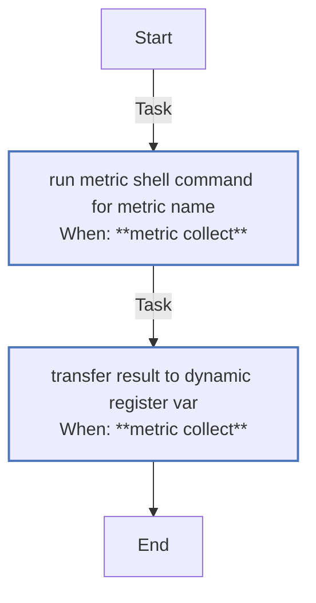
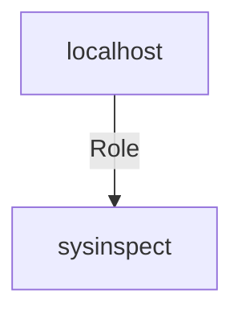

<!-- DOCSIBLE START -->

# 📃 Role overview

## sysinspect


Description: Ansible role for collecting system metrics (CPU, memory, disk, OS, and network). Designed for diagnostics, compliance reporting, monitoring integration, or automated system audits.


| Field                | Value           |
|--------------------- |-----------------|
| Readme update        | 08/05/2025 |


<details>
<summary><b>🧩 Argument Specifications in meta/argument_specs</b></summary>

#### Key: main
**Description**: Collect system metrics (CPU, memory, disk, OS, network) and generate a structured JSON report with optional webhook integration.


  - **sysinspect_debug_mode**
    - **Required**: False
    - **Type**: bool
    - **Default**: True
    - **Description**: If true, enables debug output including the final JSON report printed to the terminal.

  
  
  

  - **sysinspect_report_output_path**
    - **Required**: False
    - **Type**: str
    - **Default**: /tmp/system_report.json
    - **Description**: Path where the final JSON report will be written on the target host.

  
  
  

  - **sysinspect_report_webhook_url**
    - **Required**: False
    - **Type**: str
    - **Default**: 
    - **Description**: Optional URL of a webhook endpoint to which the report will be POSTed.

  
  
  

  - **sysinspect_collect_hardware**
    - **Required**: False
    - **Type**: bool
    - **Default**: True
    - **Description**: Whether to collect CPU, memory, and disk metrics.

  
  
  

  - **sysinspect_collect_os**
    - **Required**: False
    - **Type**: bool
    - **Default**: True
    - **Description**: Whether to collect OS version, kernel, and system uptime.

  
  
  

  - **sysinspect_collect_network**
    - **Required**: False
    - **Type**: bool
    - **Default**: True
    - **Description**: Whether to collect IP address and basic network diagnostics.

  
  
  

  - **sysinspect_cpu_alert_threshold**
    - **Required**: False
    - **Type**: int
    - **Default**: 90
    - **Description**: CPU usage percentage above which a warning alert is triggered.

  
  
  

  - **sysinspect_memory_alert_threshold**
    - **Required**: False
    - **Type**: int
    - **Default**: 90
    - **Description**: Memory usage percentage above which a warning alert is triggered.

  
  
  


</details>


### Defaults

**These are static variables with lower priority**

#### File: defaults/main.yml

| Var          | Type         | Value       |Required    | Title       |
|--------------|--------------|-------------|------------|-------------|
| [sysinspect_debug_mode](defaults/main.yml#L10)   | bool | `True` |    false  |  Enable debug mode for detailed output |
| [sysinspect_report_output_path](defaults/main.yml#L17)   | str | `/tmp/system_report.json` |    true  |  Output path for system report |
| [sysinspect_report_webhook_url](defaults/main.yml#L23)   | str |  |    false  |  Send report to webhook |
| [sysinspect_collect_hardware](defaults/main.yml#L29)   | bool | `True` |    true  |  Collect CPU, memory, and disk usage |
| [sysinspect_collect_os](defaults/main.yml#L35)   | bool | `True` |    true  |  Collect OS, kernel, and uptime info |
| [sysinspect_collect_network](defaults/main.yml#L40)   | bool | `True` |    true  |  Collect network information (IP addresses) |
| [sysinspect_cpu_alert_threshold](defaults/main.yml#L45)   | int | `90` |    false  |  CPU usage alert threshold |
| [sysinspect_memory_alert_threshold](defaults/main.yml#L50)   | int | `90` |    false  |  Memory usage alert threshold |
<details>
<summary><b>🖇️ Full descriptions for vars in defaults/main.yml</b></summary>
<br>
<table>
<th>Var</th><th>Description</th>
<tr><td><b>sysinspect_debug_mode</b></td><td>If true, the role will display additional debug information at runtime,<br>
including the final assembled JSON report before writing or sending it.<br></td></tr>
<tr><td><b>sysinspect_report_output_path</b></td><td>Path where the final JSON report will be written.</td></tr>
<tr><td><b>sysinspect_report_webhook_url</b></td><td>URL of the HTTP endpoint that will receive the report.</td></tr>
<tr><td><b>sysinspect_collect_hardware</b></td><td>Enable or disable hardware metric collection.</td></tr>
<tr><td><b>sysinspect_collect_os</b></td><td>Enable or disable operating system info collection.</td></tr>
<tr><td><b>sysinspect_collect_network</b></td><td>Enable or disable network diagnostics.</td></tr>
<tr><td><b>sysinspect_cpu_alert_threshold</b></td><td>If CPU usage exceeds this percentage, it will trigger an alert.</td></tr>
<tr><td><b>sysinspect_memory_alert_threshold</b></td><td>If memory usage exceeds this percentage, it will trigger an alert.</td></tr>
</table>
<br>
</details>


### Vars

**These are variables with higher priority**
#### File: vars/main.yml

| Var          | Type         | Value       |Required    | Title       |
|--------------|--------------|-------------|------------|-------------|
| [sysinspect_suite_name](vars/main.yml#L8)   | str | `System Inspector v2.0` |    true  |  Name of the diagnostic suite |
| [sysinspect_phases](vars/main.yml#L15)   | list | `[]` |    true  |  Phases of system inspection |
| [sysinspect_phases.**0**](vars/main.yml#L16)   | dict | `{}` |    None  |  None |
| [sysinspect_phases.0.**id**](vars/main.yml#L16)   | str | `hardware_check` |    None  |  None |
| [sysinspect_phases.0.**label**](vars/main.yml#L17)   | str | `Hardware Metrics Collection` |    None  |  None |
| [sysinspect_phases.0.**description**](vars/main.yml#L18)   | str | `Collects hardware statistics including nested device checks.` |    None  |  None |
| [sysinspect_phases.0.**subphases**](vars/main.yml#L19)   | list | `[]` |    None  |  None |
| [sysinspect_phases.0.subphases.**0**](vars/main.yml#L20)   | dict | `{}` |    None  |  None |
| [sysinspect_phases.0.subphases.0.**id**](vars/main.yml#L20)   | str | `cpu_inspect` |    None  |  None |
| [sysinspect_phases.0.subphases.0.**label**](vars/main.yml#L21)   | str | `CPU Details` |    None  |  None |
| [sysinspect_phases.0.subphases.0.**description**](vars/main.yml#L22)   | str | `Gathers model, core count, and usage per core.` |    None  |  None |
| [sysinspect_phases.0.subphases.**1**](vars/main.yml#L24)   | dict | `{}` |    None  |  None |
| [sysinspect_phases.0.subphases.1.**id**](vars/main.yml#L24)   | str | `mem_inspect` |    None  |  None |
| [sysinspect_phases.0.subphases.1.**label**](vars/main.yml#L25)   | str | `Memory Details` |    None  |  None |
| [sysinspect_phases.0.subphases.1.**description**](vars/main.yml#L26)   | str | `Retrieves total, used, and free memory.` |    None  |  None |
| [sysinspect_phases.0.subphases.**2**](vars/main.yml#L28)   | dict | `{}` |    None  |  None |
| [sysinspect_phases.0.subphases.2.**id**](vars/main.yml#L28)   | str | `disk_inspect` |    None  |  None |
| [sysinspect_phases.0.subphases.2.**label**](vars/main.yml#L29)   | str | `Disk Inspection` |    None  |  None |
| [sysinspect_phases.0.subphases.2.**description**](vars/main.yml#L30)   | str | `Inspects mounted filesystems, usage, and I/O metrics.` |    None  |  None |
| [sysinspect_phases.0.subphases.2.**conditions**](vars/main.yml#L31)   | dict | `{}` |    None  |  None |
| [sysinspect_phases.0.subphases.2.conditions.**min_disk_free_percent**](vars/main.yml#L32)   | int | `10` |    None  |  None |
| [sysinspect_phases.**1**](vars/main.yml#L34)   | dict | `{}` |    None  |  None |
| [sysinspect_phases.1.**id**](vars/main.yml#L34)   | str | `os_info_check` |    None  |  None |
| [sysinspect_phases.1.**label**](vars/main.yml#L35)   | str | `Operating System Inspection` |    None  |  None |
| [sysinspect_phases.1.**description**](vars/main.yml#L36)   | str | `Retrieves OS, kernel version, uptime.` |    None  |  None |
| [sysinspect_phases.1.**metadata**](vars/main.yml#L37)   | dict | `{}` |    None  |  None |
| [sysinspect_phases.1.metadata.**os_release_files**](vars/main.yml#L38)   | list | `[]` |    None  |  None |
| [sysinspect_phases.1.metadata.os_release_files.**0**](vars/main.yml#L39)   | str | `/etc/os-release` |    None  |  None |
| [sysinspect_phases.1.metadata.os_release_files.**1**](vars/main.yml#L40)   | str | `/etc/lsb-release` |    None  |  None |
| [sysinspect_phases.1.metadata.**include_hostname**](vars/main.yml#L41)   | bool | `True` |    None  |  None |
| [sysinspect_phases.**2**](vars/main.yml#L43)   | dict | `{}` |    None  |  None |
| [sysinspect_phases.2.**id**](vars/main.yml#L43)   | str | `network_check` |    None  |  None |
| [sysinspect_phases.2.**label**](vars/main.yml#L44)   | str | `Network Interfaces` |    None  |  None |
| [sysinspect_phases.2.**description**](vars/main.yml#L45)   | str | `Collects interface configs and ping tests.` |    None  |  None |
| [sysinspect_phases.2.**interfaces**](vars/main.yml#L46)   | list | `[]` |    None  |  None |
| [sysinspect_phases.2.interfaces.**0**](vars/main.yml#L47)   | dict | `{}` |    None  |  None |
| [sysinspect_phases.2.interfaces.0.**name**](vars/main.yml#L47)   | str | `eth0` |    None  |  None |
| [sysinspect_phases.2.interfaces.0.**expected_state**](vars/main.yml#L48)   | str | `up` |    None  |  None |
| [sysinspect_phases.2.interfaces.0.**test_ping**](vars/main.yml#L49)   | str | `8.8.8.8` |    None  |  None |
| [sysinspect_phases.2.interfaces.**1**](vars/main.yml#L50)   | dict | `{}` |    None  |  None |
| [sysinspect_phases.2.interfaces.1.**name**](vars/main.yml#L50)   | str | `wlan0` |    None  |  None |
| [sysinspect_phases.2.interfaces.1.**expected_state**](vars/main.yml#L51)   | str | `down` |    None  |  None |
| [sysinspect_phases.2.interfaces.1.**test_ping**](vars/main.yml#L52)   | NoneType | `None` |    None  |  None |
| [sysinspect_phases.**3**](vars/main.yml#L54)   | dict | `{}` |    None  |  None |
| [sysinspect_phases.3.**id**](vars/main.yml#L54)   | str | `alerting` |    None  |  None |
| [sysinspect_phases.3.**label**](vars/main.yml#L55)   | str | `Threshold & Alert Logic` |    None  |  None |
| [sysinspect_phases.3.**description**](vars/main.yml#L56)   | str | `Evaluates CPU and memory thresholds to trigger warnings.` |    None  |  None |
| [sysinspect_phases.3.**thresholds**](vars/main.yml#L57)   | dict | `{}` |    None  |  None |
| [sysinspect_phases.3.thresholds.**cpu**](vars/main.yml#L58)   | dict | `{}` |    None  |  None |
| [sysinspect_phases.3.thresholds.cpu.**warn**](vars/main.yml#L59)   | int | `75` |    None  |  None |
| [sysinspect_phases.3.thresholds.cpu.**crit**](vars/main.yml#L60)   | int | `90` |    None  |  None |
| [sysinspect_phases.3.thresholds.**memory**](vars/main.yml#L61)   | dict | `{}` |    None  |  None |
| [sysinspect_phases.3.thresholds.memory.**warn**](vars/main.yml#L62)   | int | `80` |    None  |  None |
| [sysinspect_phases.3.thresholds.memory.**crit**](vars/main.yml#L63)   | int | `95` |    None  |  None |
| [sysinspect_phases.**4**](vars/main.yml#L65)   | dict | `{}` |    None  |  None |
| [sysinspect_phases.4.**id**](vars/main.yml#L65)   | str | `json_output` |    None  |  None |
| [sysinspect_phases.4.**label**](vars/main.yml#L66)   | str | `JSON Report Structuring` |    None  |  None |
| [sysinspect_phases.4.**description**](vars/main.yml#L67)   | str | `Formats inspection output in JSON.` |    None  |  None |
| [sysinspect_phases.4.**include_metadata**](vars/main.yml#L68)   | bool | `True` |    None  |  None |
| [sysinspect_phases.4.**sanitize_keys**](vars/main.yml#L69)   | bool | `True` |    None  |  None |
| [sysinspect_phases.**5**](vars/main.yml#L71)   | dict | `{}` |    None  |  None |
| [sysinspect_phases.5.**id**](vars/main.yml#L71)   | str | `webhook_post` |    None  |  None |
| [sysinspect_phases.5.**label**](vars/main.yml#L72)   | str | `Webhook Result Push` |    None  |  None |
| [sysinspect_phases.5.**description**](vars/main.yml#L73)   | str | `Sends report to external endpoint if configured.` |    None  |  None |
| [sysinspect_phases.5.**config**](vars/main.yml#L74)   | dict | `{}` |    None  |  None |
| [sysinspect_phases.5.config.**enabled**](vars/main.yml#L75)   | bool | `True` |    None  |  None |
| [sysinspect_phases.5.config.**retry_count**](vars/main.yml#L76)   | int | `3` |    None  |  None |
| [sysinspect_phases.5.config.**timeout_seconds**](vars/main.yml#L77)   | int | `5` |    None  |  None |
| [sysinspect_phases.5.config.**endpoint**](vars/main.yml#L78)   | str | `{{ sysinspect_webhook_url ¦ default('') }}` |    None  |  None |
| [sysinspect_tool_info](vars/main.yml#L84)   | dict | `{}` |    true  |  Internal tool metadata |
| [sysinspect_tool_info.**name**](vars/main.yml#L85)   | str | `InspectorCoreShell` |    None  |  None |
| [sysinspect_tool_info.**version**](vars/main.yml#L86)   | str | `2.0.1` |    None  |  None |
| [sysinspect_tool_info.**license**](vars/main.yml#L87)   | str | `MIT-0` |    None  |  None |
<details>
<summary><b>🖇️ Full Descriptions for vars in vars/main.yml</b></summary>
<br>
<table>
<th>Var</th><th>Description</th>
<tr><td><b>sysinspect_suite_name</b></td><td>Human-readable name of the system inspection suite. Used in logging and reporting.</td></tr>
<tr><td><b>sysinspect_phases</b></td><td>Nested list of inspection phases.<br>
Each phase can contain one or more subphases with their own labels, descriptions, and conditions.<br></td></tr>
<tr><td><b>sysinspect_tool_info</b></td><td>Information used for versioning and tool identity.<br></td></tr>
</table>
<br>
</details>


### Tasks


#### File: tasks/collect_metric.yml

| Name | Module | Has Conditions | Comments |
| ---- | ------ | -------------- | -------- |
| Run metric shell command for {{ metric_name }} | ansible.builtin.shell | True | tasks file for sysinspect |
| Transfer result to dynamic register var | ansible.builtin.set_fact | True |  |

#### File: tasks/main.yml

| Name | Module | Has Conditions | Comments |
| ---- | ------ | -------------- | -------- |
| Begin system diagnostics | ansible.builtin.debug | False | tasks file for sysinspect |
| Initialize data dictionary | ansible.builtin.set_fact | False |  |
| Collect hardware metrics | block | False | --- Hardware Block --- |
| Collect CPU usage | ansible.builtin.include_tasks | False | Collect CPU usage |
| Collect memory usage | ansible.builtin.include_tasks | False | Collect memory usage |
| Collect disk usage | ansible.builtin.import_tasks | False | Collect disk usage |
| Set hardware facts | ansible.builtin.set_fact | True |  |
| Collect OS metrics | block | False | --- OS Block --- |
| Get OS version | ansible.builtin.import_tasks | False |  |
| Get kernel version | ansible.builtin.include_tasks | False |  |
| Get uptime | ansible.builtin.include_tasks | False |  |
| Set OS facts | ansible.builtin.set_fact | True |  |
| Collect network info | block | False | --- Network Block --- |
| Get main IP address | ansible.builtin.include_tasks | False |  |
| Set network fact | ansible.builtin.set_fact | True |  |
| Check threshold alerts | block | False | --- Resource Threshold Alerts --- |
| Alert on high CPU | ansible.builtin.debug | True |  |
| Alert on high memory | ansible.builtin.debug | True |  |
| Append role configuration to report data | ansible.builtin.set_fact | False | --- Include Configuration Parameters into Report --- |
| Show final system report JSON (debug mode) | ansible.builtin.debug | True | --- Debug Final Report --- |
| Write system report to JSON file | ansible.builtin.copy | False | --- Output JSON --- |
| Send report to webhook | ansible.builtin.uri | True | --- Send to webhook if URL is defined --- |


## Task Flow Graphs


### Graph for collect_metric.yml




### Graph for main.yml

```mermaid
flowchart TD
Start
classDef block stroke:#3498db,stroke-width:2px;
classDef task stroke:#4b76bb,stroke-width:2px;
classDef includeTasks stroke:#16a085,stroke-width:2px;
classDef importTasks stroke:#34495e,stroke-width:2px;
classDef includeRole stroke:#2980b9,stroke-width:2px;
classDef importRole stroke:#699ba7,stroke-width:2px;
classDef includeVars stroke:#8e44ad,stroke-width:2px;
classDef rescue stroke:#665352,stroke-width:2px;

  Start-->|Task| Begin_system_diagnostics0[begin system diagnostics]:::task
  Begin_system_diagnostics0-->|Task| Initialize_data_dictionary1[initialize data dictionary]:::task
  Initialize_data_dictionary1-->|Block Start| Collect_hardware_metrics2_block_start_0[[collect hardware metrics]]:::block
  Collect_hardware_metrics2_block_start_0-->|Include task| Collect_CPU_usage_collect_metric_yml_0[collect cpu usage<br>include_task: collect metric yml]:::includeTasks
  Collect_CPU_usage_collect_metric_yml_0-->|Include task| Collect_memory_usage_collect_metric_yml_1[collect memory usage<br>include_task: collect metric yml]:::includeTasks
  Collect_memory_usage_collect_metric_yml_1-->|Import task| Collect_disk_usage_collect_metric_yml_2[/collect disk usage<br>import_task: collect metric yml/]:::importTasks
  Collect_disk_usage_collect_metric_yml_2-->|Task| Set_hardware_facts3[set hardware facts<br>When: **sysinspect collect hardware**]:::task
  Set_hardware_facts3-.->|End of Block| Collect_hardware_metrics2_block_start_0
  Set_hardware_facts3-->|Rescue Start| Collect_hardware_metrics2_rescue_start_0[collect hardware metrics]:::rescue
  Collect_hardware_metrics2_rescue_start_0-->|Task| Log_hardware_collection_failure0[log hardware collection failure]:::task
  Log_hardware_collection_failure0-.->|End of Rescue Block| Collect_hardware_metrics2_block_start_0
  Log_hardware_collection_failure0-->|Block Start| Collect_OS_metrics3_block_start_0[[collect os metrics]]:::block
  Collect_OS_metrics3_block_start_0-->|Import task| Get_OS_version_collect_metric_yml_0[/get os version<br>import_task: collect metric yml/]:::importTasks
  Get_OS_version_collect_metric_yml_0-->|Include task| Get_kernel_version_collect_metric_yml_1[get kernel version<br>include_task: collect metric yml]:::includeTasks
  Get_kernel_version_collect_metric_yml_1-->|Include task| Get_uptime_collect_metric_yml_2[get uptime<br>include_task: collect metric yml]:::includeTasks
  Get_uptime_collect_metric_yml_2-->|Task| Set_OS_facts3[set os facts<br>When: **sysinspect collect os**]:::task
  Set_OS_facts3-.->|End of Block| Collect_OS_metrics3_block_start_0
  Set_OS_facts3-->|Rescue Start| Collect_OS_metrics3_rescue_start_0[collect os metrics]:::rescue
  Collect_OS_metrics3_rescue_start_0-->|Task| Log_OS_info_collection_failure0[log os info collection failure]:::task
  Log_OS_info_collection_failure0-.->|End of Rescue Block| Collect_OS_metrics3_block_start_0
  Log_OS_info_collection_failure0-->|Block Start| Collect_network_info4_block_start_0[[collect network info]]:::block
  Collect_network_info4_block_start_0-->|Include task| Get_main_IP_address_collect_metric_yml_0[get main ip address<br>include_task: collect metric yml]:::includeTasks
  Get_main_IP_address_collect_metric_yml_0-->|Task| Set_network_fact1[set network fact<br>When: **sysinspect collect network**]:::task
  Set_network_fact1-.->|End of Block| Collect_network_info4_block_start_0
  Set_network_fact1-->|Rescue Start| Collect_network_info4_rescue_start_0[collect network info]:::rescue
  Collect_network_info4_rescue_start_0-->|Task| Log_network_info_collection_failure0[log network info collection failure]:::task
  Log_network_info_collection_failure0-.->|End of Rescue Block| Collect_network_info4_block_start_0
  Log_network_info_collection_failure0-->|Block Start| Check_threshold_alerts5_block_start_0[[check threshold alerts]]:::block
  Check_threshold_alerts5_block_start_0-->|Task| Alert_on_high_CPU0[alert on high cpu<br>When: **system data cpu usage   default 0    sysinspect<br>cpu alert threshold**]:::task
  Alert_on_high_CPU0-->|Task| Alert_on_high_memory1[alert on high memory<br>When: **system data memory usage   default 0    sysinspect<br>memory alert threshold**]:::task
  Alert_on_high_memory1-.->|End of Block| Check_threshold_alerts5_block_start_0
  Alert_on_high_memory1-->|Rescue Start| Check_threshold_alerts5_rescue_start_0[check threshold alerts]:::rescue
  Check_threshold_alerts5_rescue_start_0-->|Task| Threshold_alert_processing_failed0[threshold alert processing failed]:::task
  Threshold_alert_processing_failed0-.->|End of Rescue Block| Check_threshold_alerts5_block_start_0
  Threshold_alert_processing_failed0-->|Task| Append_role_configuration_to_report_data6[append role configuration to report data]:::task
  Append_role_configuration_to_report_data6-->|Task| Show_final_system_report_JSON__debug_mode_7[show final system report json  debug mode <br>When: **sysinspect debug mode**]:::task
  Show_final_system_report_JSON__debug_mode_7-->|Task| Write_system_report_to_JSON_file8[write system report to json file]:::task
  Write_system_report_to_JSON_file8-->|Task| Send_report_to_webhook9[send report to webhook<br>When: **sysinspect report webhook url**]:::task
  Send_report_to_webhook9-->End
```




## Playbook

```yml
#SPDX-License-Identifier: MIT-0
---
- name: Sysinspect playbook
  hosts: localhost
  remote_user: root
  roles:
    - ../sysinspect

```
## Playbook graph


## Author Information
Lucian BLETAN

#### License

MIT

#### Minimum Ansible Version

2.1

#### Platforms

No platforms specified.

#### Dependencies

No dependencies specified.
<!-- DOCSIBLE END -->
